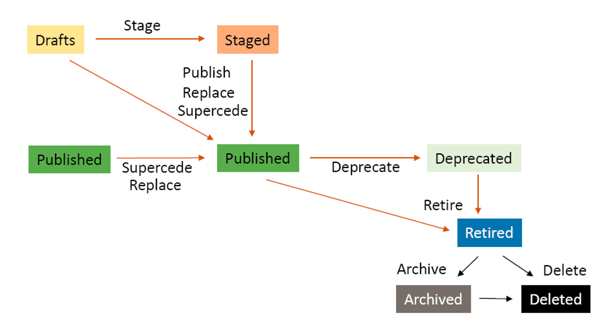
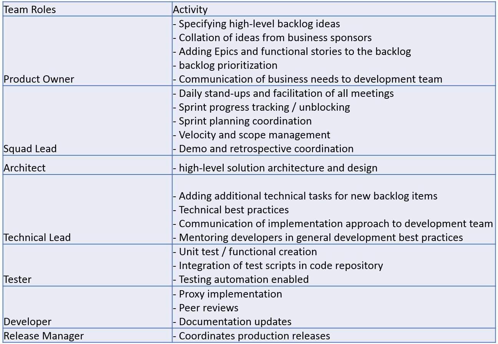
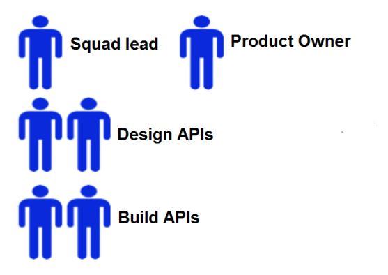
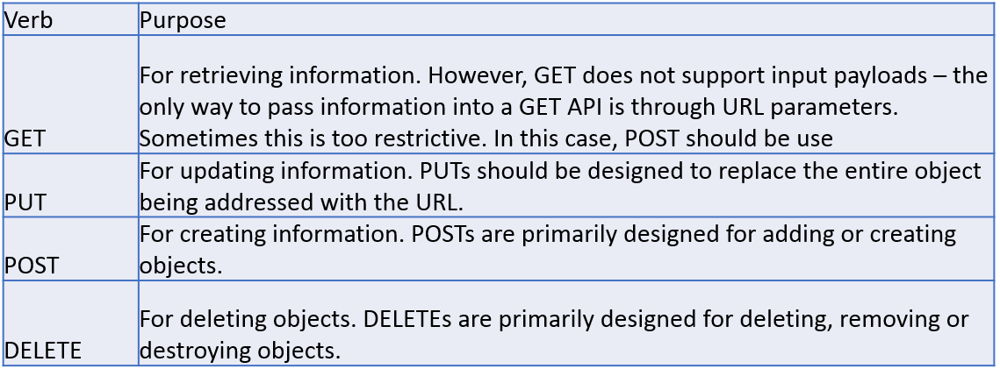
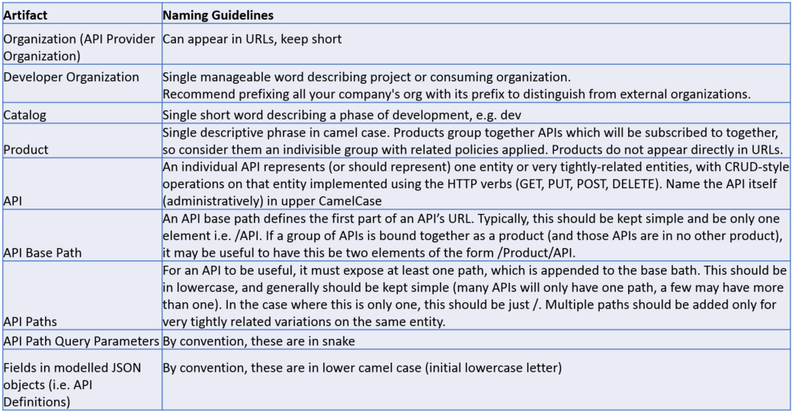
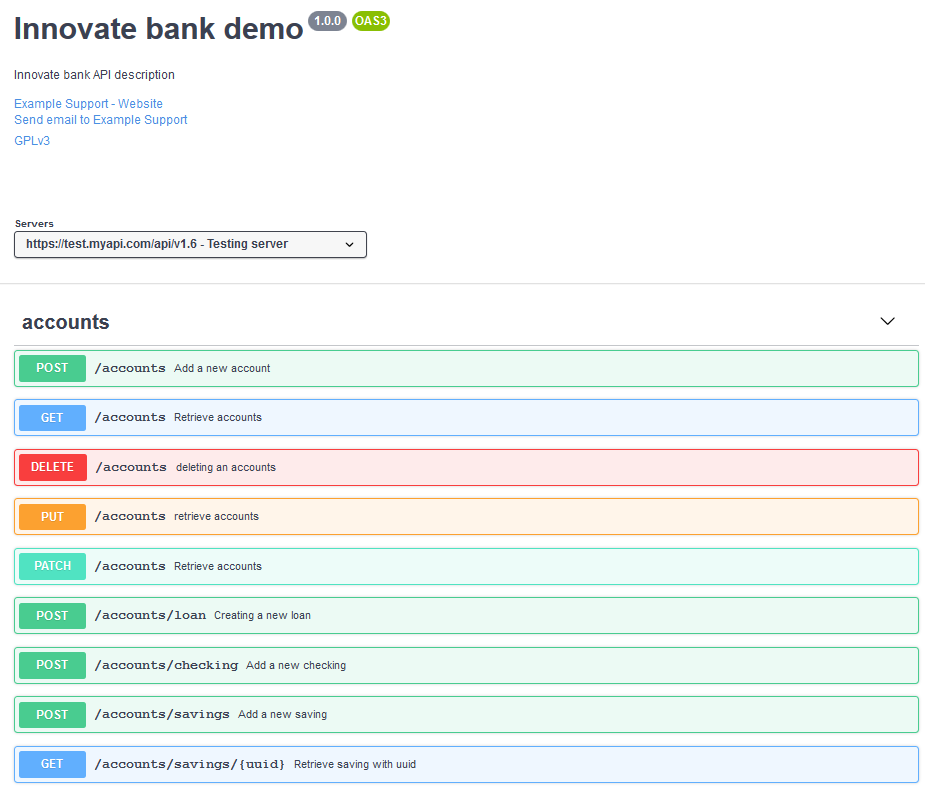
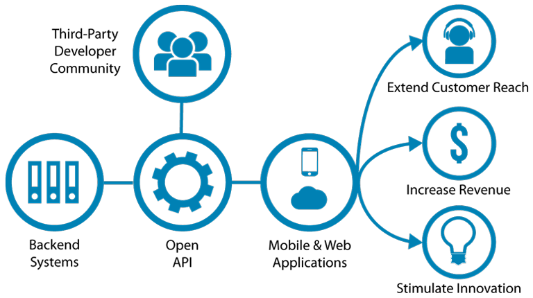

# API Lifecycle and Governance in the Enterprise: Design Part 2 of 3
The  API Economy is helping companies transform and realize opportunities  that were never obtainable before the emergence of the cloud. The cloud  is a game-changer and disrupts most companies, both from within and from  new market players, using application programming interfaces (APIs).  Thus, the proliferation of API-related technologies is shaping the way  businesses interact with each other by offering new capabilities. APIs  are adding an essential layer of agility which help to sustain the  flexibility required to acquire more clients or partners, by sharing  data and grow their business. An API management solution is now  imperative for any company, and it is an essential part of its digital  transformation strategy. “*Digital transformation is the next big thing after the industrial revolution.*” [*](https://medium.com/api-product-management/design-apis-human-centered-to-build-successful-api-products-ffe35015cee5)

APIs with a **good design**  should make it easy to learn and work with by providing an abstraction  layer between the fluidity of the Systems of Engagement and the rigidity  of the Systems of Record.

In the [previous post](https://medium.com/ibm-garage/api-lifecycle-and-governance-in-the-enterprise-plan-stage-part-1-of-3-d350b65080a2),  we discussed the importance of planning an API initiative strategy and  governance model. The focus was on the four main components related to  API management, which includes **creating**, **running**, **managing**, and **securing** APIs.  Part II will draw more on the practical aspect of designing APIs, and  what does it entail and why is API design so important? Producing APIs  require a multi-disciplinary team made of product development,  engineers, developers, program managers, and others discussed in the API  Team section.

Continuing  our discussion with the first criteria of any API, which are its  lifecycle and governance. Thus, managing the lifecycle of **APIs as first-class products**  and decide when an API must be retired is most important. Before  embarking on the journey, these are some basic questions you need to  answer while designing any API:

- Who is your targeted audience?
- How are the APIs classified as external (**Open-To-All APIs**), partner (**Open-To-Partner APIs**), internal (**Private APIs**)?
- Are they aligned with business functions or requirements?
- Who gets to define which APIs get built?
- Who pays for their development?


Figure 1: API Lifecycle States and Approvals

| API   Lifecycle Stage / State                      | Stage Description                                            |
| -------------------------------------------------- | ------------------------------------------------------------ |
| Proposed                                           | A proposal to create new API, change existing API or retire existing API.   Typically, the API Contract document would be drafted during this phase |
| Approved to Plan (Part of Candidate API   Catalog) | Approved API Proposal (New/Change/Retire) by Design Council. Typically,   the API Contract would be further refined during this phase. |
| Approved to Build                                  | Approved API Specifications by Technical Architecture Board. |
| Draft                                              | Product or API definition is not deployed and is not associated with any   catalog. |
| Staged                                             | A copy of the Product version is deployed to the target catalog. Staged   is the initial state when you publish a Product. When a Product is in the   staged state, it is not yet visible to, or subscribe-able by, any developers. |
| Published                                          | A fixed copy of the Product version is deployed to the target catalog.   The Product version is visible to, and subscribe-able by, the targeted   developers or communities. When a Product is published in a catalog, the   visibility and subscription settings can be changed for the published version   of that Product. Any further changes require a new version of the Product to   be staged and published before they take effect. |
| Deprecated                                         | The Product version is visible only to developers whose applications are   currently subscribed. No new subscriptions to the Plans in the Product are   possible. |
| Retired                                            | The Product version can neither be viewed nor can its Plans be subscribed   to, and all of the associated APIs are no longer available. |
| Archived                                           | The Product version can neither be viewed nor can its Plans be subscribed   to, and all of the associated APIs are stopped. The Product version is not   displayed by default in the Products tab of the catalog in API Manager. |
| Replace                                            | Applicable if new version has signature compatible with previous   version’s All subscriptions are force-migrated; Original version is retired   from catalog (May require approval, pending until then) |
| Supercede                                          | New version is published (with same visibility etc). Original version is   deprecated (May require approval, pending until then) |
| Timely migration                                   | Auto-notify subscribers when   product version is deprecated Force-migrate as last resort |

Figure 2: API Lifecycle Stage

# API Team

Governance  is an essential element to ensure smooth visibility over your APIs;  recently, APIs are changing the technology governance models. APIs are  moving away from a stifling and rigid process over to a more flexible  approach where the likes of **squads** and **guilds**  are favored over the more traditional bureaucratic and glacial  progress. The rise of APIs and the API Economy introduced a more agile  approach to Requirements and Specifications and Build/Delivery for  technical teams. In this model, squads design and build APIs on the  platform of their choosing using common tooling and automation to speed  up the release cycle. Squads own Epics — groups of related User Stories —  from birth to retirement.


Figure 3: API Team: Team Roles and Activities


Figure 4: Build Squad Structure

# API Design Guidelines

It  is easy to get overwhelmed with API design. This section recommends the  establishment of standards for APIs going forward. All API design  should adhere to the guidelines discussed here. Typically, there are a  variety of considerations which are essential when designing new APIs.  Some of the critical design decisions are included in the following  subsections for inclusion in all conversations.

# Is a New API Needed?

The  first key question to be considered when building a new API is; is a  new API needed? There are basically three decision points here:

1. Does an API already exist with the appropriate functionality?
2. Does an API exist that the functionality could easily be added to?
3. Should the API be reused, or a duplicate/variant API be created?

In  general, there is a trade-off between having APIs shared (common)  between projects and APIs specific (dedicated) to projects. The former  is generally to be preferred from a technical perspective and is more  closely aligned with the standard approach adopted for API Connect —  that of creating an API Economy for generic APIs which can be adopted by  any new project.

The advantages in having a shared API are:

- There  is considerably less development & test effort ongoing —  functionality, development and maintenance effort is shared between  projects.
- There  is a smaller catalogue of APIs — there is greater clarity for new API  consumers on which API to use in any given situation.

The disadvantages are:

- Lifecycles  are more tightly coupled — APIs are shared between projects and so  changes to one API are likely to affect another project also using that  same API. If this turns out to be a problem in a specific case, an API’s  source code can be branched in source control, so that one API is split  from another. However, a new API would have to be introduced for at  least one consumer/project, which would cause disruption as endpoints  would need to be changed.
- It  likely implies creation of new organizations within the company (namely  the Technical Architecture Board and Design Council referred to in Key  Organization Entities) to manage centrally developed and owned APIs.

Given all of this, the approach we would recommend is:

- Make APIs shared between projects/use cases where there is a significant degree of common functionality.
- On  a case-by-case basis, exceptions can be made to “fork” the API for  specific projects where that project would have a significant business  impact if there were outage or bug-fixing issues. That helps to keep the  API independent of others.

# What Makes a Suitable API?

APIs  should be driven by a purpose that has business meaning and are  intended to be lightweight. This means they should be thin layers over  existing services — APIs are there to do lightweight protocol transformation, policy enforcement, security enforcement, etc.  Their primary purpose is not to provide choreography, fan-out/fan-in  style service invocation, etc. This is consistent with the support and  the development methodology that the API Connect product supports. We  discuss appropriate and inappropriate API implementations in more detail  in the next post. The value of API Connect should focus on the  externals and the primary differentiators between a simple RESTful  service and an API — the ability to straightforwardly secure APIs, the  ability to control an API through its lifecycle, manage and collect APIs  together in products, socialize APIs on the developer portal, etc.

# RESTful Practices

Fundamentally,  all APIs built on API Connect are RESTful services, and so the best  practices that are followed for other RESTful services should be  followed for APIs in the same way. When constructing an API’s  external-exposed interface, there are 5 things we need to design:

1. The URL it will be exposed on — **/x/y/z**
2. The HTTP verbs it will use — **GET**, **PUT**, **POST**, or **DELETE** (there are others, but they are rarely used)
3. In some cases, the URL parameters to be passed to the API — **?x=y&a=b**
4. The input payload (doesn’t exist in the case of GET or DELETE) that we send into the service. Typically, a JSON object.
5. The output payload that comes back from the service. Typically, a JSON object.

URLs  should be structured in a logical entity-focused manner. For example,  if dealing with an Account, Account would be an appropriate entity.  “GetAccount”, “SearchAccount”, etc. would not — they don’t include  actions or verbs in the URL. So, you might have a URL that looks like:

```
/account
```

In some cases, it might make sense to handle different types of accounts (Loan, Checking, Savings, etc.) in the same API — perhaps passing a URL parameter to distinguish between them, or something in the input JSON  object. In other cases, it might make sense to have distinct URLs:

```
/account/loan
/account/checking
/account/savings
```

Note that we are not using `/loan/account` etc. — the hierarchy should flow from least-specific to most. HTTP verbs should be assigned like this (remember you can have the same URL with two different verbs — and hence different logic — if it makes sense to do so).

API  consumers need to be aware of the HTTP response codes that API  Connect-based APIs can throw, and API designers need to design APIs to  throw HTTP response codes consistent with the standard approach of HTTP  itself.

HTTP itself defines a vast range of response codes — a complete list can be found here: https://en.wikipedia.org/wiki/List_of_HTTP_status_codes. However, for most purposes:

- **200** — OK: Everything worked as expected.
- **400** — Bad Request: The request was unacceptable, often due to a missing or malformed parameter.
- **401** — Unauthorized: No valid bearer token provided.
- **404** — Not Found: The requested resource doesn’t exist.
- **429** — Too Many Requests: Too many requests hit the API too quickly. We recommend an exponential back-off of your requests.
- **500**, **502**, **503**, **504** — Server Failed: Something went wrong on the server’s end.

In  most cases, the API Connect tools and framework will itself do the  right thing and throw appropriate response codes — the relevant  reference is here: https://www.ibm.com/support/knowledgecenter/SSMNED_2018/mapfiles/getting_started.html.  In fact, in many cases, which error codes are thrown is not even within  the control of the API designer. When it is, the API Designer needs to  select an appropriate error code when a back-end system is not  functioning correctly. Typically, HTTP 500 is suitable for this.

# Use of Right HTTP Methods

The  HTTP protocol defines several methods that assign semantic meaning to a  request. The standard HTTP methods used by most RESTful web APIs are:


Figure 5: HTTP common verbs

### Naming Standards for APIs

In general, there are various artifacts in API Connect, which must be named. To gain the benefit of consistency and clarity, we recommend the following. Currently your artifacts for existing projects may not follow these standards. That is not a serious issue, but over time, it could be a low-priority project to adopt these names for existing artifacts as they are refactored/improved.


Figure 6: Naming Standards for APIs

### API Version

API versioning is a crucial part of the design; you’ll need to consider modifying your API, as a fundamental thing to do. And this is where an API versioning strategy is required. Either by adding more clients and or requirement changes might cause a need for a new version. Eventually, you will change something, such as adding new product lines or offerings. These versions can occupy any of the lifecycle stages and will facilitate development with minimal to no disruption to client’s applications when new updates are rolled out. Another important fact is that channels are evolving at a different pace, especially in Internet Banking, Mobile channel, or ATM channel. Being able to version the API, so that older version of the API is still there. While the channel not yet migrated while a newer version of the API is set up for the modernized channel, this is quite useful.

Earlier, we mentioned about the various stages of the lifecycle. The three production versions at each level relate to the following states:

- **Live**: New consumers must use this version.
- **Superseded**: New consumers can subscribe to this version in extenuating circumstances.
- **Deprecated**: New consumers must not use this version.

| Version | URI                       | State      |
| ------- | ------------------------- | ---------- |
| V1.6    | api/v1.6/account/checking | Live       |
| V1.5    | api/v1.5/account/checking | Suspended  |
| V1.4    | api/v1.4/account/checking | Deprecated |

Figure 7: API Version

You can choose to differentiate your API versions through URI Path. The REST API includes the version number in the URL path as shown below; which is my personal favorite, and they are:

- Versioning through URI Path 
  \- [https://test.myapi.com/api/v1.6/account/checking](https://test.myapi.com/api/account/checking)
- Versioning through query parameters 
  \- [https://test.myapi.com/api/account/checking?version=1.6](http://www.myapi.com/api/account/checking?version=1.6)
- Versioning through custom headers 
  \- curl -H “Accepts-version: 1.6” [https://test.myapi.com/api/account/checking](http://www.myapi.com/api/account/checking)
- Versioning through content negotiation 
  \- curl -H “Accept: application/vnd.xm.device+json; version=1.6” [https://test.myapi.com/api/account/checking](http://www.myapi.com/api/account/checking)

### Defining The Data Model

Documenting your REST API is an activity part of the design phase. It’s part of the design-first approach, which advocates for designing the API’s contract first before writing any code. This technique ensures that your API design hides your internal implementation details while exposing the information necessary to store and retrieve the business services using web APIs. Refer to this **[link](./API/innovate-API_3.0_v2.yaml)** for a full description of the API contract aligned with the target solution. We leveraged on the Swagger edit https://editor.swagger.io/ for API design and documentation, especially with the use of OpenAPI Specification (OAS) formats.


Figure 8: Innovate bank API 3.0

### Understanding the Business Model

Companies are starting to understand the driving forces behind API usage, as well as the potential business models and monetization strategies APIs can help create. API business models are categorized into four distinct models: Free, Developer Pays, Developer gets Paid and Indirect:

> **Free model:** drives adoption of APIs and brand loyalty. Facebook is the most prominent example of a for free model.

> **Developer pays**: which breaks down further into pay-as-you go (for example, Amazon enables developers to pay for only what they use), transaction fee (such as PayPal), or unit-based (such as Google AdWords).

> **Developer gets paid:** directly, using affiliates or a revenue sharing model.

> **Indirect:** where, for example, Salesforce.com offers APIs for third-party developers to extend their platform. eBay APIs support sellers with content population that indirectly results in revenue. [*](http://www.redbooks.ibm.com/abstracts/redp5096.html?Open)


Figure 9: What is an API? and What is the API Economy?

### Conclusion

This second post provided an overview of API Design, their characteristics, business value, lifecycle, and strategy. These aspects of APIs are all present in the API Economy, which is a dynamic exchange of interactions and transactions of services, assets, data, and ideas between developers, businesses, and consumers.

APIs are a platform for innovation and the development of applications and services to build new connections between business, services, developers, and consumers and to create new streams of information sharing and revenue.

------

Thoughts and ideas are much appreciated! And if you would like to learn more about how you can co-create with the [**IBM Garage**](https://www.ibm.com/services/garage), please check out our website https://www.ibm.com/services/garage to book a visit with our team.

### Attribution

Special thank you to [**Enrique (Ike) Relucio**](mailto:relucio@ph.ibm.com?source) from **IBM Garage ASEAN**, who shared his knowledge of the banking industry and the API Economy. Also, thank you to [**Julien Chenelat**](mailto:julienpc@sg.ibm.com?source) from **Digital Banking, Associate Partner, IBM iX ASEAN Global Business Services** who shared his expertise on digital transformation in the financial markets and banking.

### References

- [The Power of the API Economy: Stimulate Innovation, Increase Productivity, Develop New Channels, and Reach New Markets](http://www.redbooks.ibm.com/abstracts/redp5096.html?Open)
- [Getting Started with IBM API Connect: Concepts and Architecture Guide](http://www.redbooks.ibm.com/abstracts/redp5349.html?Open)
- [Getting Started with IBM API Connect: Scenarios Guide](http://www.redbooks.ibm.com/abstracts/redp5350.html?Open)
- [API Lifecycle: Design Stage (Part 2 of 4)](https://medium.com/@godigitalML/api-lifecycle-design-stage-part-2-of-4-943b3368b136)
- [Three ways API management transforms your organization](https://medium.com/@SnapLogic/three-ways-api-management-transforms-your-organization-a1c49285696f)
- [Human-Centered API Design](https://medium.com/api-product-management/design-apis-human-centered-to-build-successful-api-products-ffe35015cee5)
- [Four strategies to version APIs](https://chrisphillips-cminion.github.io/apiconnect/2019/05/24/apiversioning.html)
- [What is an API? and What is the API Economy?](https://developer.ibm.com/apiconnect/2018/01/04/api-api-economy/)
- [Reach new customers with the API economy](https://www.ibm.com/cloud/api-economy)
